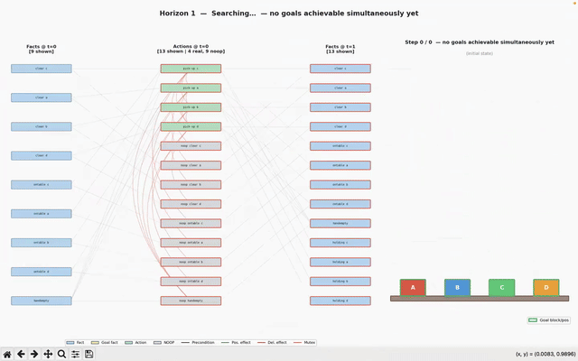
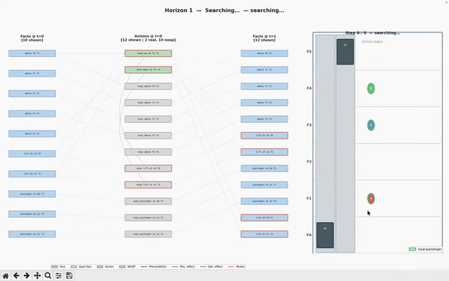

# SATPLAN Project — Progress Report

**Date:** April 23, 2026  
**Repository:** `lhakimhli02/SATPLAN`

---

## Overview

This project builds two complete **AI planning systems** in Python. Given a description of a world (what actions are possible, what the starting state is, and what goal you want to reach), both systems automatically find a sequence of actions — a **plan** — that gets from the start to the goal.

The core idea is to turn the planning problem into a **Boolean satisfiability (SAT)** problem: encode everything as logical clauses and ask a SAT solver whether a plan of length *T* exists. If the solver says "satisfiable", it returns a model that directly decodes into a plan.

Both systems use **PDDL** (Planning Domain Definition Language), the standard file format used in AI planning research and competitions to describe actions and problems.

### What is GraphPlan?

GraphPlan is a classic planning algorithm (Blum & Furst, 1997). It builds a **planning graph** — a layered data structure that alternates between *fact layers* (what is true at step *t*) and *action layers* (what actions can fire at step *t*). It also tracks **mutexes** — pairs of facts or actions that cannot both be true/applied at the same time step. This graph compactly encodes all possible parallelizable plans up to a given horizon.

### What is SATPlan / BlackBox?

**SATPlan** (Kautz & Selman, 1992) encodes the planning problem as a SAT formula and hands it to a modern SAT solver. **BlackBox** (Kautz & Selman, 1998) combines both ideas: first build a GraphPlan graph to get structure and mutex information, then encode *that graph* as CNF clauses and solve with SAT. This is often faster than pure GraphPlan backward search because modern SAT solvers are highly optimized.

### Why BlackBox Beats Pure GraphPlan

Pure GraphPlan finds plans using **backward search**: starting from the goal layer, it tries to select a set of non-mutex actions that achieve the goals, then recurses back toward the initial state. This works, but has two major weaknesses:

1. **Exponential search space.** At each layer, GraphPlan must choose which subset of actions to apply. The number of possible subsets grows exponentially with the number of actions — even with mutex pruning, the backtracking search can be very slow on hard problems.

2. **No learning.** When GraphPlan tries a combination that fails, it records it as a "nogood" (a dead end to avoid), but this information is discarded between horizons. Every time the horizon grows by one step, the search mostly starts over.

BlackBox sidesteps both problems by handing the search off to a **SAT solver**:

- Modern SAT solvers (like CaDiCaL or Glucose) use **Conflict-Driven Clause Learning (CDCL)** — when they hit a dead end, they analyze *why* it failed, derive a new clause that rules out that failure pattern, and add it permanently to the formula. This learned information prunes enormous parts of the search space automatically.
- SAT solvers are also highly optimized with decades of engineering (unit propagation, watched literals, restart strategies, variable activity heuristics), making them far faster in practice than hand-written backtracking search.
- With **incremental SAT**, BlackBox keeps the solver session alive across horizons — all clauses learned at horizon *T* are still present at horizon *T+1*. The solver only needs to process the new layer, not restart from scratch.

The planning graph is still valuable in BlackBox — it gives the SAT formula tighter mutex constraints than a direct encoding would, which means fewer satisfying assignments to search through. GraphPlan does the structural work; SAT does the combinatorial search.

### The Two Planners at a Glance

| System | Approach |
|--------|----------|
| **BlackBox** (`blackbox_python/`) | PDDL → GraphPlan graph → CNF → SAT solver |
| **SATplan** (`satplan_python/`) | PDDL → ground STRIPS actions → CNF → SAT solver |

The key difference: BlackBox builds a planning graph first and encodes that; SATplan skips the graph entirely and encodes the grounded actions directly.

---

## Prerequisites and Background Reading

This project assumes familiarity with basic AI concepts (search, propositional logic). Before reading the implementation details, the following background will help:

**Core concepts you should understand:**
- **Propositional logic** — variables, AND/OR/NOT, satisfiability (SAT)
- **STRIPS planning** — actions with preconditions and add/delete effects
- **CNF (Conjunctive Normal Form)** — a formula expressed as a conjunction of clauses, each a disjunction of literals. SAT solvers work exclusively on CNF.

**Key papers (read in this order):**
1. Kautz & Selman (1992) — *"Planning as Satisfiability"* (ECAI) — the original SATPlan idea: encode planning as SAT
2. Blum & Furst (1997) — *"Fast Planning Through Planning Graph Analysis"* (Artificial Intelligence) — the GraphPlan algorithm
3. Kautz & Selman (1998) — *"BlackBox: A New Approach to the Application of Theorem Proving to Problem Solving"* (AIPS Workshop) — combines GraphPlan + SAT
4. McDermott et al. (1998) — *"PDDL — The Planning Domain Definition Language"* — the file format both planners use

**For SAT solver internals:**
- Marques-Silva et al. (2021) — *"Conflict-Driven Clause Learning SAT Solvers"* (Handbook of Satisfiability) — explains CDCL, the algorithm inside CaDiCaL/Glucose/MiniSat

---

## Getting Started

**Installation (Python 3.10+):**

```bash
pip install python-sat matplotlib
```

**Run BlackBox on the included Blocksworld example:**

```bash
cd Blackbox/blackbox_python
python blackbox.py -o pddl_problems/blocksworld_domain.pddl -f pddl_problems/blocksworld_problem.pddl
```

**Run SATplan on the included Depot example:**

```bash
cd satplan_python
python satplan.py -o pddl_problems/domain.pddl -f pddl_problems/problem.pddl
```

**Watch an animated demo:**

```bash
cd Blackbox/blackbox_python
python animate_blocksworld.py -o pddl_problems/blocksworld_domain.pddl -f pddl_problems/blocksworld_problem.pddl
```

**See per-category clause counts as the formula grows:**

```bash
python count_clauses.py -o pddl_problems/blocksworld_domain.pddl -f pddl_problems/blocksworld_problem.pddl
```

See the [README](README.md) for the complete flag reference and solver chaining syntax.

---

## 1. BlackBox Python (`blackbox_python/`)

A complete Python rewrite of the classic BlackBox planner (Kautz & Selman, 1998).

### How It Works (Step by Step)

1. **Parse PDDL** — read the domain (action schemas) and problem (objects, initial state, goal).
2. **Build a planning graph** — starting from the initial facts, repeatedly apply all applicable actions to grow a layered graph of reachable facts and actions. Track mutex pairs at each layer (facts or actions that can never both hold at the same step).
3. **Encode as CNF** — convert the graph into a set of logical clauses (the SAT formula). Each fact and action at each time step becomes a Boolean variable. Clauses enforce preconditions, effects, frame axioms (things stay true unless changed), and mutex constraints.
4. **Call a SAT solver** — if the solver finds a satisfying assignment, decode it back into a plan. If not, extend the graph by one step and try again.
5. **Minimize actions** — once a plan is found, search for shorter plans (fewer total actions) at slightly longer makespans.

### Pipeline

```
PDDL files
    │
    ▼
pddl_parser.py      ← reads domain and problem files
    │
    ▼
graphplan.py        ← builds the layered planning graph + mutex sets
    │
    ▼
graph2wff.py        ← encodes the graph as CNF clauses
    │
    ▼
sat_interface.py    ← calls the SAT solver
    │
    ▼
planner.py          ← search loop, solver chaining, action minimization
    │
    ▼
justify.py          ← removes unnecessary actions from the solution
```

### Module Details

| File | Role |
|------|------|
| `blackbox.py` | CLI entry point; argument parsing, solver spec parsing, timing breakdown |
| `planner.py` | Planning loop; iterative horizon search; solver dispatch; action minimization via cardinality constraints; plan output |
| `graphplan.py` | Builds the layered planning graph; tracks reachable facts and actions at each step; computes mutex pairs; supports incremental extension |
| `graph2wff.py` | Converts the planning graph to CNF clauses; supports five axiom encoding presets; uses AMO ladder encoding for mutex cliques |
| `sat_interface.py` | Wrappers for 7 SAT solver backends; stateful incremental solver session that reuses learned clauses across horizons |
| `utilities.py` | Mutex computation helpers (exists-step semantics) |
| `data_structures.py` | Core types: `Vertex`, `Operator`, `HashTable`, `SolverSpec`, result codes |
| `pddl_parser.py` | Typed STRIPS PDDL parser (`:strips`, `:typing`, `:equality`) |
| `justify.py` | Removes redundant actions from the found plan |
| `count_clauses.py` | Prints per-category clause counts (`Vars / Total / Init / Goal / Precond / Frame / Mutex AMO`) at each horizon |

### SAT Encoding Presets (`-axioms`)

These control which logical constraints are included in the CNF formula. More constraints can prune the search space but add more clauses.

| Value | What's included |
|-------|----------------|
| 7 (default) | Mutex actions + preconditions + frame axioms |
| 15 | Above + mutex facts |
| 31 | Above + explicit action → effect clauses |
| 63 | Above + redundant (but sometimes helpful) clauses |
| 129 | Action-only encoding (no explicit fact propositions) |

### Key Engineering Choices

- **AMO ladder encoding**: when many actions are mutually exclusive, encoding "at most one fires" with a ladder structure uses O(3k) clauses instead of O(k²) for pairwise — much more efficient for large mutex cliques.
- **Exists-step semantics**: two actions are only declared mutex if *both* orderings (A then B, and B then A) violate a precondition. This is less restrictive than forall-step, allowing more parallelism in plans.
- **Incremental SAT**: instead of re-solving from scratch at each horizon, the solver session is kept alive and only new clauses are added. The solver can reuse everything it already learned.
- **Solver chaining**: try one solver with a time limit, automatically fall back to another if it times out (e.g., `-solver -maxsec 30 glucose -then cadical`).

### PDDL Benchmarks Included

| Problem | Description |
|---------|-------------|
| `blocksworld_problem.pddl` | Stack 4 blocks into a tower |
| `elevator_problem.pddl` | 4 floors, 2 passengers, 1 elevator |
| `elevator_problem2.pddl` | 6 floors, 3 passengers, 2 elevators |

Additional benchmark suites under `Blackbox/BlackBox-master/Examples/`: Logistics (30 problems, STRIPS and typed), Bulldozer, Fridge, Tire-World, Woodshop, and large Blocksworld variants.

---

## 2. SATplan Python (`satplan_python/`)

An original direct STRIPS-to-SAT planner that skips the planning graph entirely.

### How It Differs from BlackBox

Instead of building a planning graph first, SATplan **grounds** the PDDL actions directly — substituting all possible object combinations into each action schema to produce a flat list of concrete actions (e.g., `stack_A_B`, `stack_A_C`, `unstack_B_C`, …). It then encodes these grounded actions directly into CNF clauses without any intermediate graph structure.

This is simpler conceptually and avoids the graph construction cost, but loses the mutex propagation information that GraphPlan provides for free.

### Pipeline

```
PDDL files
    │
    ▼
pddl_parser.py       ← shared parser (same as BlackBox)
    │
    ▼
grounder.py          ← instantiates all concrete actions from schemas
    │
    ▼
strips_encoder.py    ← encodes actions + fluents directly as CNF
    │
    ▼
sat_interface.py     ← shared SAT solver layer
    │
    ▼
satplan_planner.py   ← planning loop, solver dispatch, action minimization
```

### Module Details

| File | Role |
|------|------|
| `satplan.py` | CLI entry point; same flags as `blackbox.py` plus a few STRIPS-specific extras |
| `satplan_planner.py` | Planning loop; action minimization; plan output |
| `grounder.py` | Instantiates all type-compatible ground actions from PDDL schemas; prunes using static predicates |
| `strips_encoder.py` | Encodes fluent/action variables, initial state, goal, preconditions, effects, frame axioms, and mutex clauses into CNF |
| `count_clauses.py` | Per-category clause counter: `Vars / New Clauses / Init (CWA) / Goal / Precond / Effects / Frame axioms / Mutex AMO` |

### CNF Encoding Explained

For each time step `t`, the following clauses are added:

| Clause type | What it says | Formula |
|------------|-------------|---------|
| **Initial state** | Every fluent is explicitly set true or false at t=0 (closed-world assumption) | `[+f₀]` or `[-f₀]` |
| **Goal** | Required fluents must hold at the final step T | `[+f_T]` or `[-f_T]` |
| **Preconditions** | If an action fires, its required facts must hold | `¬aₜ ∨ fₜ` |
| **Effects** | If an action fires, it changes the world | `¬aₜ ∨ f_{t+1}` |
| **Frame axioms** | Facts only change if some action caused the change | `¬f_{t+1} ∨ fₜ ∨ (adders…)` |
| **Mutex** | Conflicting actions can't both fire at step t | `¬a1_t ∨ ¬a2_t` |

### Bugs Found and Fixed

**Bug 1 — Incorrect type-based grounding pruning**

The grounder tried to be smart: it looked at unary predicates in a precondition (like `clear(x)`) to infer what type `x` should be, and then only grounded actions for objects where that predicate was true in the initial state.

The problem: `clear` is a *changing* fluent — it starts true for some blocks but becomes false when you stack something on them. Using it as a type filter meant actions like `stack_A_B` were pruned because `clear(B)` happened to be false in the initial state. This made the goal `on(A, B)` unreachable (no action could add it), so the problem was always UNSAT.

**Fix:** Only use *static* predicates — ones that never appear in any action's effects — as type filters. Dynamic predicates like `clear` are now ignored during pruning.

**Bug 2 — Wrong mutex condition**

The initial mutex check declared two actions incompatible if their effects conflicted (e.g., one adds `f` and the other deletes `f`). But conflicting effects don't actually prevent the actions from being applied in sequence — they just mean one undoes the other. Only *precondition* violations matter for exists-step mutex.

**Fix:** Removed the effect-conflict check; only precondition interference (`a.del_eff ∩ b.pos_pre ≠ ∅` or vice versa) triggers a mutex.

### Benchmark Results

| Problem | Horizon found | Actions | Solve time |
|---------|:------------:|:-------:|:----------:|
| Blocksworld 4 blocks | 6 | 6 | ~0.01 s |
| Depot (`depotprob1818`) | 4 | 15 | ~0.08 s |
| Trivial 1-action problem | 1 | 1 | <0.01 s |

### SATplan-Only Flags

| Flag | Effect |
|------|--------|
| `-nocwa` | Disable closed-world assumption at t=0 (unknown fluents left unset) |
| `-noeffects` | Omit explicit effect clauses (rely on frame axioms only) |
| `-nomutex` | Disable all mutex constraints |
| `-forallstep` | Stricter mutex: actions are mutex if either ordering fails (fewer parallel actions allowed) |
| `-sequential` | Allow at most one action per time step (sequential planning) |

---

## 3. Graph Visualization

Two interactive graph renderers built with `matplotlib` let you see the planning graph grow layer by layer.

### Standard Renderer (`visualize_graphplan.py`)

Displays three columns per layer: **Facts @ t | Actions @ t | Facts @ t+1**.

**Color key:**
- Blue = reachable fact
- Yellow = goal fact  
- Green = real action
- Gray = no-op (a "do nothing" placeholder action)
- Red border = has at least one mutex partner

**Edge key:**
- Dark edges = precondition links (fact required by action)
- Green edges = positive effect (action adds this fact)
- Red edges = delete effect (action removes this fact)
- Red arcs = mutex pair

**Navigation:** Left/Right arrow keys step through layers; `s` saves the current layer as PNG; `q` or Escape quits.

### Clustered Renderer (`visualize_graphplan_clustered.py`)

An alternative layout designed for Blocksworld. Instead of edges, it groups facts by predicate into a semantic status board:
- Top: `on(x,y)` shown as an N×N reachability grid
- Middle: `clear(x)`, `ontable(x)`, `holding(x)`, `handempty`
- Bottom: real actions in a compact list

This makes it easier to see *what is true* at each horizon rather than tracing individual causal links.

---

## 4. Animations

Two animated demos show the planner working in real time. Each uses a two-panel layout: the **planning graph growing** on the left and the **world executing the plan** on the right.

### Demos

**Blocksworld** — a robotic arm stacks blocks into a goal configuration



**Elevator** — one or two elevators deliver passengers to their goal floors



### What the Animation Shows

1. **Search phase** (before a plan is found): the planning graph grows one layer per frame. The world panel shows the best partial plan found so far — how close the planner is getting to the goal.
2. **Execution phase** (once a plan is found): the world panel animates the plan step by step with smooth interpolation.

### Blocksworld (`animate_blocksworld.py`)

- Block movement uses three-phase smooth interpolation: lift → slide → lower.
- Goal blocks are highlighted with a green border.
- `--clustered` flag switches the graph panel to the predicate-clustered layout.

### Elevator (`animate_elevator.py`)

- Building schematic with shaft(s), a smoothly moving car, and passengers as colored circles.
- Passengers inside the car appear as smaller inset circles.
- Supports single and multi-elevator problems.

### Animation Options (both scripts)

| Flag | Description |
|------|-------------|
| `--steps N` | Max horizons to search before giving up |
| `--interval N` | Milliseconds per plan step during execution |
| `--save <path>` | Export as `.mp4` or `.gif` instead of displaying |
| `--no-noop` | Hide no-op actions in the graph panel |
| `--max-facts N` | Cap the number of fact nodes shown per column |
| `--max-actions N` | Cap the number of action nodes shown per column |

---

## 5. Live Elevator Simulation (`live-graphplan/`)

A dynamic planning system where passengers arrive at random floors during execution. The planner re-invokes GraphPlan from the **current state** each time new passengers appear, rather than replanning from the original initial state or patching the old plan by hand.

### The Problem

Classical planning assumes a closed world: the initial state and goals are fully known before the solver runs. Real systems do not have this luxury. An elevator controller must handle passengers who press the button mid-trip. The question is how to respond without throwing away all prior planning work.

Two naive options have obvious costs:

- **Do nothing** — ignore new arrivals until the current plan finishes, then replan. Passengers wait unnecessarily.
- **Full restart** — on every arrival, discard the current plan and replan from the initial state. Wasteful: you re-derive everything you already knew.

The approach here is in between: **incremental replanning from the current state**. The elevator's executed history is preserved; only the unexecuted suffix is replaced by a new GraphPlan solution computed from where the elevator actually is right now, with all currently unserved passengers (including those already boarded in the car).

### Two-Phase Design

**Phase 1 — Initial solve (once)**

`solve_graphplan()` is called once at startup with a set of seed passengers. It generates a PDDL problem file from the initial state, runs the BlackBox GraphPlan+SAT pipeline, and returns a list of `PlanStep` objects representing the plan. This is identical to the standard BlackBox solve.

**Phase 2 — Incremental replanning (on each arrival batch)**

Each simulation step:
1. New passengers are generated stochastically (probability `p` per floor).
2. If any arrived, `solve_graphplan_from_state()` is called with:
   - The elevator's **current floor**
   - All passengers currently **waiting** at their pickup floors
   - All passengers currently **boarded** in the elevator (represented as `(boarded p e0)` in the PDDL `:init` section so the planner knows to *leave* them rather than board them)
3. The new plan replaces `plan_steps[current_step:]`. The executed prefix is kept as history; `current_step` is unchanged.
4. One plan step is executed and state is updated.

Because the new PDDL problem starts from the current elevator floor with the current passenger set, the replanner produces an optimal plan from *this moment* — not from the beginning.

### Architecture

```
live-graphplan/
    │
    ├── elevator_domain.py   ← PDDL generation, GraphPlan solve, plan extraction
    ├── live_simulator.py    ← simulation loop, replanning trigger, state tracking
    ├── plan_repair.py       ← earlier repair-only approach (kept for reference)
    └── main.py              ← CLI demo
```

| File | Role |
|------|------|
| `elevator_domain.py` | `generate_problem_pddl_from_state()` builds PDDL with boarded passengers in `:init`; `solve_graphplan_from_state()` runs the full BlackBox pipeline from a mid-execution state; `_extract_steps()` converts the solved graph into a `list[PlanStep]` |
| `live_simulator.py` | `LiveElevatorSimulator` drives the loop; `_replan()` collects waiting + boarded passengers and calls `solve_graphplan_from_state`; `_apply_action()` tracks which passengers have actually reached their destination |
| `main.py` | ASCII building visualizer; per-step replan indicator with timing; summary statistics |

### Correctness Fix: the `can_stop` Guard

A subtle bug exists in the naive horizon loop:

```python
# naive — WRONG for mid-execution replanning
for horizon in range(1, max_steps + 1):
    if planner.do_plan(horizon) == Sat:   # ← triggers too early
        return _extract_steps(graph, horizon, lift_floor)
```

`do_plan(horizon)` internally calls `setup_goals(horizon)`, which only includes goals that are *reachable* in the planning graph at that horizon. If two goals happen to be reachable at `horizon = 1` (e.g., leaving two already-boarded passengers at the current floor), the SAT solver returns `Sat` for just those two goals, ignoring the rest. The plan covers only a fraction of the passengers.

The fix is to call `graph.can_stop(horizon)` before `do_plan`. `can_stop` checks that **every** goal fact is present in the graph layer at `horizon` and that no two are mutex — exactly the condition that guarantees the solver will be asked about all goals:

```python
for horizon in range(1, max_steps + 1):
    if not graph.can_stop(horizon):   # all goals reachable and non-mutex?
        continue
    if planner.do_plan(horizon) == Sat:
        return _extract_steps(graph, horizon, lift_floor)
```

This fix applies to both `solve_graphplan` (initial solve) and `solve_graphplan_from_state` (replanning). For the initial solve it was harmless — goals with waiting passengers are not reachable at small horizons — but for mid-execution replanning with boarded passengers it was critical.

### Modeling Boarded Passengers in PDDL

The elevator domain's `leave` action has the precondition `(boarded ?p ?lift)`. If a passenger is already in the elevator when we replan, they are represented in the new PDDL `:init` section as:

```pddl
(boarded p3 e0)
```

rather than `(passenger-at p3 f_pickup)`. Their goal remains `(passenger-at p3 f_dest)`. The planner then knows it only needs a `leave` action at the right floor — no `board` is required. This correctly models the elevator's mid-trip state without any special casing in the planner itself.

### Running the Demo

```bash
cd live-graphplan
python main.py --floors 5 --prob 0.25 --steps 20 --seed-passengers 2 --seed 42
```

| Flag | Description |
|------|-------------|
| `--floors N` | Number of floors (default: 5) |
| `--prob P` | Per-floor passenger arrival probability each step (default: 0.25) |
| `--steps N` | Total simulation steps to run (default: 20) |
| `--seed-passengers N` | Seed passengers given to the initial GraphPlan solve (default: 2) |
| `--seed S` | Random seed for reproducibility (default: 42) |
| `--stop-on-done` | Halt once all known passengers are delivered |
| `--debug` | Print GraphPlan solver output during each replan |

### Example Output

```
  Step   9  │  Plan steps remaining: 6  ↻ REPLANNED (223 ms)
  ────────────────────────────────────────────────────
  F3  [p13,p14,p16]  wait: p1,p12,p5
  F2       
  F1         wait: p15
  F0       
  NEW ARRIVALS : p15(F1→F3), p16(F2→F3)
  Actions      : move-up(f2→f3), board(p14@f2), board(p16@f2)
  Delivered    : ['p0', 'p10', 'p11', 'p2', 'p3', 'p4', 'p6', 'p7', 'p8', 'p9']
```

The `↻ REPLANNED` tag shows when GraphPlan was re-invoked and how long it took. The new plan (6 remaining steps) accounts for the elevator's current position, all boarded passengers, all waiting passengers, and the new arrivals — all solved together optimally in a single GraphPlan call.

---

## 6. Available SAT Solvers

Both planners support the same set of SAT solver backends. Modern CDCL solvers (CaDiCaL, Glucose, etc.) are dramatically faster than naive search for most planning problems.

| Solver | How it's used | Incremental? | Notes |
|--------|--------------|:------------:|-------|
| `cadical` | PySAT library | Yes | Default; top-ranked in SAT competitions |
| `glucose` | PySAT library | Yes | Strong on structured/industrial problems |
| `maple` | PySAT library | Yes | SAT Competition 2018 winner |
| `minisat` | PySAT library | Yes | Classic baseline CDCL solver |
| `dpll` | Pure Python | No | Basic DPLL with Jeroslow-Wang heuristic; educational |
| `kissat` | External binary | No | State-of-the-art; install via pip or build from source |
| `walksat` | External binary | No | Stochastic local search; fast but can't prove UNSAT |
| `graphplan` | Built-in | — | BlackBox only; classic backward-chaining search (no SAT) |

**Incremental** means the solver session stays open across horizons — learned clauses carry over, so the solver doesn't start from scratch every time the horizon grows. This makes a large difference in speed on harder problems.

---

## 7. SATplan AIMA (`SATplan_AIMA/`)

An earlier prototype that implements SATPlan using the code framework from the textbook *Artificial Intelligence: A Modern Approach* (Russell & Norvig). This was the starting point before the full PDDL-based rewrite.

It encodes planning problems as propositional logic formulas and solves them with a built-in CDCL solver. Included demos:
- `run_blocks_satplan.py` — Blocksworld (tries horizons 0–10)
- `driver_log_satplan.py` — DriverLog domain

This module is useful as a simpler, more readable reference for understanding how SATPlan works at a high level before diving into the full PDDL systems.

---

## 8. IPC Benchmark Domains (`IPC3/`)

This directory contains planning domains from the **International Planning Competition 3** — a major benchmark suite used to evaluate AI planners. Each domain comes in several variants (STRIPS-only, Numeric, Timed, etc.). The STRIPS variants work directly with both planners.

| Domain | What it models |
|--------|---------------|
| Depots | Moving crates between depots using trucks and hoists |
| DriverLog | Routing trucks and drivers across a road network |
| ZenoTravel | Flying passengers between cities (fuel-aware) |
| Rovers | Planetary rovers collecting samples and transmitting data |
| Satellite | Scheduling satellite instruments to take images |
| FreeCell | The card game |
| Settlers | Resource-gathering and settlement building |

---

## 9. Supported PDDL

Both planners handle **typed STRIPS** — the most common planning problem format. More advanced PDDL features (numeric quantities, time, conditional effects) are not supported.

| Supported | Not supported |
|-----------|--------------|
| `:strips` — basic add/delete effects | Conditional effects |
| `:typing` — typed objects | Disjunctive preconditions |
| `:equality` — object equality tests | Quantified goals (`forall`, `exists`) |
| | Derived predicates |
| | Numeric fluents |
| | Durative (timed) actions |

---

## 10. Benchmark Study (`benchmarks/`)

### Problems

Six Blocksworld problems of three difficulty levels were used.
All use the same 4-operator domain (`blocks_domain.pddl`).

| ID | Description | Init state | Goal |
|----|-------------|-----------|------|
| S1 | 3 blocks, build tower | A, B, C on table | ON B A, ON C B |
| S2 | 4 blocks, swap two towers | AB tower + CD tower | A on C on D on B |
| M1 | 5 blocks, build full tower | All on table | ON A B, ON B C, ON C D, ON D E |
| M2 | 5 blocks, merge towers | AB + CDE towers | A on B on C on D on E |
| H1 | 7 blocks, build full tower | All on table | 6 on-top pairs |
| H2 | 6 blocks, reverse tower | A-B-C-D-E-F tower | reversed F-E-D-C-B-A |

Problems were scaled from 3 to 7 blocks. The H1 7-block tower is the hardest instance:
grounding produces 56 actions and requires solving at horizon 12.

### Configurations Benchmarked

| Config | Planner | Description |
|--------|---------|-------------|
| BB-default | BlackBox | Graph + SAT; incremental encoding |
| BB-noincsat | BlackBox | Graph + SAT; fresh solver per horizon |
| SP-default | SATplan | Direct STRIPS→SAT; exists-step; incremental; ladder AMO |
| SP-noincsat | SATplan | Direct STRIPS→SAT; non-incremental SAT |
| SP-nomutex | SATplan | Mutex constraints disabled |
| SP-forallstep | SATplan | Forall-step mutex semantics |
| SP-pairwiseamo | SATplan | Pairwise AMO encoding instead of ladder |
| SP-forall+nomutex | SATplan | Forall-step + no mutex (minimal constraint set) |

### Results

All timings are wall-clock seconds on a MacBook (Apple Silicon). Timeout was 60 s per run.
All runs solved within 2 s; no timeouts occurred.

#### Small problems (3–4 blocks)

| Config | S1 time | S1 plan | S2 time | S2 plan |
|--------|---------|---------|---------|---------|
| BB-default | 0.130 s | 4 | 0.214 s | 10 |
| BB-noincsat | 0.096 s | 4 | 0.256 s | 10 |
| SP-default | 0.084 s | 4 | 0.095 s | 10 |
| SP-noincsat | 0.089 s | 4 | 0.138 s | 10 |
| SP-nomutex | 0.080 s | 5 | 0.081 s | 14 |
| SP-forallstep | 0.079 s | 4 | 0.094 s | 10 |
| SP-pairwiseamo | 0.078 s | 4 | 0.091 s | 10 |
| SP-forall+nomutex | 0.076 s | 5 | 0.078 s | 14 |

#### Medium problems (5 blocks)

| Config | M1 time | M1 plan | M2 time | M2 plan |
|--------|---------|---------|---------|---------|
| BB-default | 0.275 s | 8 | 0.152 s | 6 |
| BB-noincsat | 0.321 s | 8 | 0.144 s | 6 |
| SP-default | 0.099 s | 8 | 0.091 s | 6 |
| SP-noincsat | 0.136 s | 8 | 0.112 s | 6 |
| SP-nomutex | 0.081 s | 11 | 0.081 s | 8 |
| SP-forallstep | 0.097 s | 8 | 0.086 s | 6 |
| SP-pairwiseamo | 0.096 s | 8 | 0.085 s | 6 |
| SP-forall+nomutex | 0.085 s | 11 | 0.083 s | 8 |

#### Hard problems (6–7 blocks)

| Config | H1 time | H1 plan | H2 time | H2 plan |
|--------|---------|---------|---------|---------|
| BB-default | 1.161 s | 12 | 0.295 s | 12 |
| BB-noincsat | 1.696 s | 12 | 0.278 s | 12 |
| SP-default | 0.715 s | 12 | 0.110 s | 12 |
| SP-noincsat | 1.141 s | 12 | 0.253 s | 12 |
| SP-nomutex | 0.087 s | 28 | 0.089 s | 26 |
| SP-forallstep | 0.554 s | 12 | 0.104 s | 12 |
| SP-pairwiseamo | 0.534 s | 12 | 0.109 s | 12 |
| SP-forall+nomutex | 0.091 s | 28 | 0.087 s | 26 |

### Analysis

**BlackBox vs SATplan.**
SATplan (direct STRIPS→SAT) consistently outperforms BlackBox on every problem.
On the hardest instance (H1, 7 blocks), SATplan is **1.6× faster** (0.72 s vs 1.16 s).
The gap grows with problem size: on small problems the difference is marginal (~40 ms),
but on H1 BlackBox spends most of its time constructing the planning graph (56 actions,
7-level graph) before even encoding the SAT formula.
Both planners find **identical optimal plan lengths**, confirming they solve the same problem.

**Incremental SAT.**
Keeping the SAT solver session alive across horizon increments is consistently beneficial.
On H1 the speedup is **1.6× for SATplan** (0.715 s vs 1.141 s) and
**1.5× for BlackBox** (1.161 s vs 1.696 s).
The benefit arises because at each new horizon only one new time-layer of clauses needs to be
learned; previous horizons are already in the solver's clause database.

**Mutex on vs off.**
Disabling mutex constraints (`-nomutex`) makes the SAT instance much easier to solve —
H1 drops from 0.715 s to 0.087 s — but the resulting plan is **2.3× longer**
(28 steps vs 12).  Without mutual-exclusion constraints, the planner is allowed to schedule
conflicting actions in the same time step, which is unsound for sequential execution.
This confirms that mutex constraints are essential for plan correctness, not optional.

**Exists-step vs forall-step.**
Forall-step semantics (every non-mutex action at a time step must execute if its
preconditions hold) adds more constraints.  On H1 it is paradoxically **slightly faster**
(0.554 s vs 0.715 s) while finding the **same plan length** (12).
The tighter constraint set reduces the search space the SAT solver must explore.
On smaller problems the difference disappears (both ~0.08–0.10 s).

**Ladder AMO vs pairwise AMO.**
For Blocksworld, pairwise AMO is marginally faster or tied with ladder AMO
(H1: 0.534 s vs 0.715 s).
This is counter-intuitive: ladder encoding uses O(3k) clauses vs O(k²/2) for pairwise,
so ladder should win for large cliques.
The reason is that Blocksworld mutex cliques are **small** (2–4 actions per clique at most),
and ladder encoding introduces auxiliary variables that add overhead for small cliques.
On domains with larger mutex cliques (e.g., logistics, satellite) ladder encoding would
show a clear advantage.

**Summary table.**

| Dimension | Winner | Effect on plan length | Notes |
|-----------|--------|-----------------------|-------|
| Planner | SATplan faster | Same | 1.6× on hardest instance |
| Incremental SAT | Incremental faster | Same | 1.5–1.6× speedup |
| Mutex | Off is faster | Longer (2.3×) | Off is unsound |
| Step semantics | Forall-step slightly faster | Same | Tighter constraint = less search |
| AMO encoding | Pairwise faster here | Same | Domain-dependent; ladder wins on large cliques |

---

## Accomplished So Far

| What was built | Details |
|---------------|---------|
| BlackBox planner (Python rewrite) | PDDL → GraphPlan → CNF → SAT; 8 solver backends; incremental encoding; action minimization |
| SATplan (original) | Direct STRIPS → CNF without a planning graph; faster on some benchmarks |
| Two critical bugs fixed | Grounding pruning (static vs. dynamic predicates) and mutex computation |
| Planning graph visualizer | Two layout modes: standard edge-based and predicate-clustered |
| Animated demos | Blocksworld and Elevator with live graph growth + smooth world execution |
| Live elevator simulation | Stochastic passenger arrivals; GraphPlan replanned from current state (not initial state) on each batch of arrivals; boarded passengers encoded as `(boarded p e0)` in PDDL `:init`; `can_stop` guard prevents partial-goal false positives |
| Shared infrastructure | Parser, SAT interface, and data structures reused across both planners |
| Clause analysis tool | Per-category CNF clause counter for profiling encoding size |
| Benchmark runs | Blocksworld (6 steps, ~0.01s), Depot depotprob1818 (15 actions, ~0.08s), trivial 1-action problem |
| Full benchmark study | 6 Blocksworld problems × 8 configs; SATplan 1.6× faster than BlackBox on hardest instance; incremental SAT 1.5–1.6× faster; mutex required for plan correctness (off → 2.3× longer plans) |
| Encoding variants tested | `-axioms` presets 7/15/31/63/129 benchmarked; AMO ladder vs. pairwise clause counts measured |
| Mutex semantics comparison | Both exists-step (default) and forall-step (`-forallstep`) implemented and verified correct |
| Sequential vs. parallel planning | `-sequential` flag implemented and tested alongside parallel (exists-step) planning |
| IPC3 benchmark suite integrated | 7 competition domains available for testing both planners out of the box |
| AIMA prototype | Earlier textbook-based SATPlan prototype included as a simpler pedagogical reference |

---

## How This Repo Was Created

This project was built on top of several existing resources and tools:

**Original BlackBox planner**
The `blackbox_python/` implementation is a Python rewrite of the original BlackBox planner by Henry Kautz and Bart Selman (1998). The original C source code and documentation are available at [Henry Kautz's BlackBox page](https://henrykautz.com/). The core algorithms — planning graph construction, CNF encoding presets, AMO ladder encoding, and solver chaining — follow the design described in their AIPS-98 paper.

**Planning domains**
PDDL domain and problem files were sourced and adapted using the [Planning.Domains editor](https://editor.planning.domains), a browser-based environment for writing, testing, and sharing PDDL problems. The IPC3 benchmark domains (`IPC3/`) come from the International Planning Competition 3 benchmark suite.

**Implementation assistance**
The Python implementation — including the SATplan direct encoding, bug fixes to the grounding and mutex logic, the visualization and animation scripts, and the overall project structure — was developed with assistance from [Claude](https://claude.ai/claude-code) (Anthropic's AI coding assistant).
